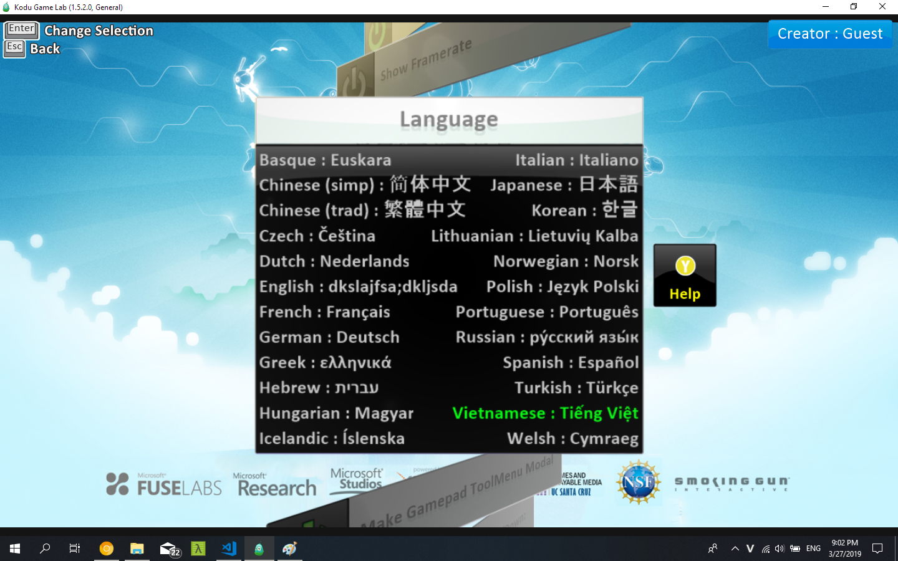
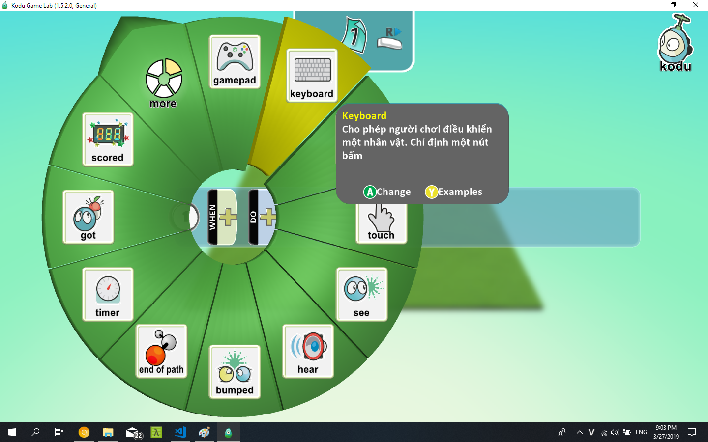
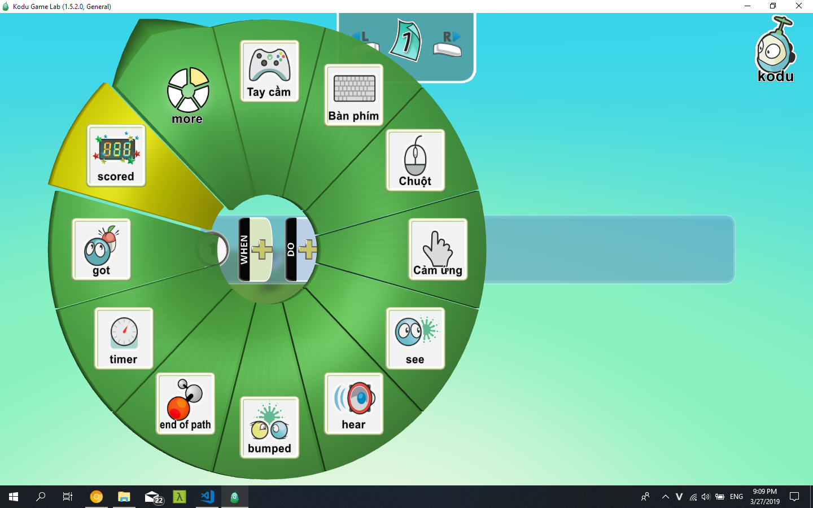

# Cách contribute
- Tạo một branch với username của mình
- Push code của mình lên đó
- Tạo pull request
- Không push lên master
## Cách dịch:
### Thấy chỗ nào giống một câu văn tiếng Anh bình thường (có dấu cách đàng hoàng) thì dịch.
### Dù dịch cái gì cũng phải copy nguyên cái thẻ xml gốc chưa dịch ra, comment bản gốc lại, dịch bản sau, như thế này để tiện proof reading:
```xml
    <!-- <a label="English">English<a> -->
    <a label="Tiếng Việt">Tiếng Việt<a>
```
### Lưu ý:
- `&lt;` `&gt;` là các dấu <, >, giữ nguyên nó
- File [Cards.xml](./VN/Cards.xml): dịch các thẻ kẹp chữ, có tham số `label` (dịch cả `label`)
- File [Help.xml](./VN/Help.xml): dịch các thẻ `description`
- File [TutorialCrumbs.xml](./VN/TutorialCrumbs.xml) [TutorialStrings.xml](./VN/TutorialStrings.xml): dịch các thẻ nào có chữ Text
- File [TweakScreenHelp.xml](./VN/TweakScreenHelp.xml): dịch các thẻ `desc`

### Thấy cái gì đó phân vân thì hãy hỏi anh em.

# Những gì tìm hiểu được về cách Kodu xử lý phần ngôn ngữ
- Trong thư mục `C:\Program Files (x86)\Microsoft Research\Kodu Game Lab\Content\Xml\Localizable` chứa một file `Locales.xml` để list các ngôn ngữ và các thư mục chứa ngôn ngữ đó.
- Khi mở Kodu lên, nó sẽ init một thư mục người dùng mới ở `Documents\SaveGames\Player1\Content\Xml\Localizable`
- Đúng ra thì nó phải copy cái file `Locales.xml`  từ `C:\Program Files...` vào thư mục `SaveGames`
- Nhưng thực tế theo kiểm tra thì Kodu nó không thèm sờ đến file này, và tự ghi một file `Locales.xml` mới ở `SaveGames`.
- Sau đó mỗi khi mình chọn một ngôn ngữ sử dụng thì nó copy thư mục ngôn ngữ từ `C:\Program Files...` vào `SaveGames` và sử dụng ở đó

# Cách test
- Cần khởi động Kodu một lần sau khi cài (cái chính là tạo thư mục `Documents\SaveGames\Boku`)
- Copy thư mục [VN](./VN) và [Locales.xml](./Locales.xml) vào `Documents\SaveGames\Player1\Content\Xml\Localizable`
    - Trong thư mục `C:\Program Files\ ... \Localizable` cũng có một file `Locales.xml`, và 
- Chạy Kodu, chọn tiếng Việt, restart.

# Nhận xét
- Cách đáng ra là đúng nhất phải là copy thư mục [VN](./VN) và [Locales.xml](./Locales.xml) vào `C:\Program Files (x86)\Microsoft Research\Kodu Game Lab\Content\Xml\Localizable`. Nhưng Kodu không lấy file `Locales.xml` ở đó nên không khả thi.

- Có thể để thư mục `VN` vào `C:\Program Files` và `Locales.xml` vào `SaveGames`. Ta sẽ có được một menu như sau 
nhưng cách này không đủ ổn định vì phụ thuộc vào thư mục `SaveGames` (thay đổi user hay gì đó có thể bị ảnh hưởng chăng?)

- Vậy có một cách hơi xấu một chút nhưng đảm bảo an toàn là ghi đè tiếng việt vào một ngôn ngữ khác không ai dùng bao giờ (chắc là cái nào cũng được trừ tiếng Anh) rồi cho học sinh chọn tiếng đó.

- Về lâu dài có thể liên lạc với team dev của Kodu để contribute bản dịch này.

# Demo

